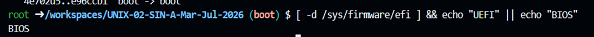
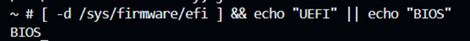
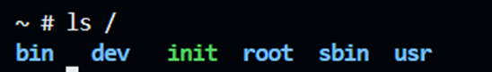
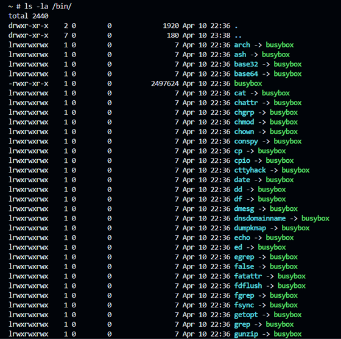
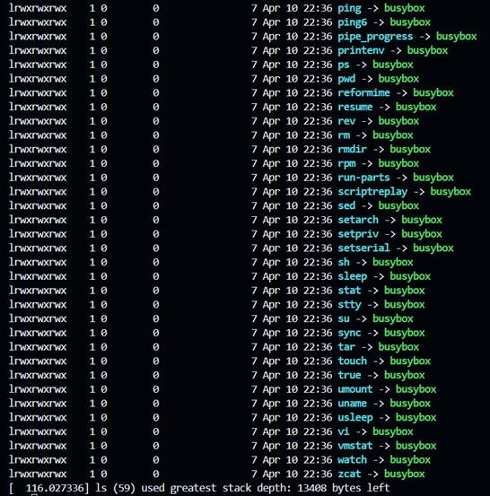
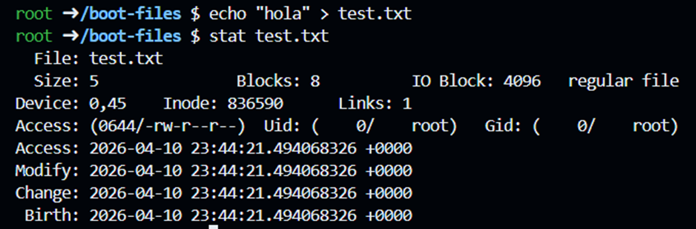
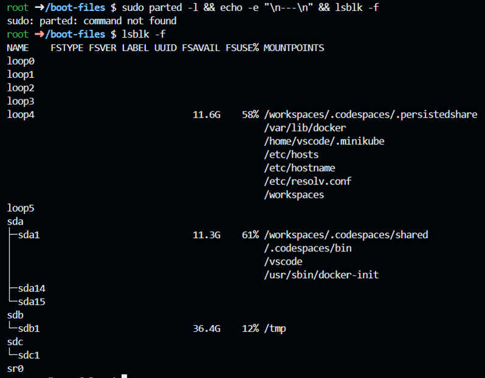

-----------------Answer Questions-------------------
Explain what each directory listed by the previous command is for in the context of BusyBox
The difference is that in BusyBox all of these commands are actually the same binary. Can
verify it within QEMU:
/ # ls -la /bin/ls
# you will see that it is a symbolic link to /bin/busybox

Running ls -la /bin/ls within QEMU confirms that /bin/ls -> busybox, i.e. the ls command is not a standalone executable but a symbolic link pointing to the busybox binary. This applies to all system commands — when you run ls, grep or vi, it actually always runs the same busybox program, which internally detects what name it was called under and executes the corresponding function.

1. Check the firmware type: Run [ -d /sys/firmware/efi ] && echo "UEFI" ||
echo "BIOS" both in the Codespace and within QEMU. What result do you get and why?

In the Codespace the result was BIOS, because the GitHub Codespaces virtual machine was provisioned without UEFI, so the /sys/firmware/efi directory does not exist. Within QEMU the result was also BIOS, because QEMU by default emulates a traditional BIOS firmware (SeaBIOS) unless explicitly configured with UEFI.

2. Inspect the structure: Within QEMU, run ls / and compare with the structure of
directories that we saw in class. What directories are missing and why?

When executing ls / within QEMU, only the directories are observed: bin, dev, init, root, sbin and usr. Compared to the FHS standard seen in class, directories such as etc, home, lib, mnt, opt, tmp, var, boot and proc are missing. These directories do not exist because our distro is minimal — the initramfs only contains BusyBox and the init script, without a full root system. There are no configurations, users, or services, just what is necessary to get a shell.

3. Explore BusyBox: Inside QEMU, run ls -la /bin/ and notice that all commands
They are symbolic links to the same binary. What advantage does this have for an embedded system?

By executing ls -la /bin/ within QEMU you can see that the 59 available commands such as cat, grep, pwd, vi, tar, ping, among others, are symbolic links that point to the same busybox binary. The advantage for an embedded system is the space saving, instead of having dozens of independent executables, BusyBox groups them into a single ~2.4 MB binary, detecting which name it was called with to execute the corresponding function, which is ideal for devices with limited storage.

4. Browse blocks: In Codespace, create a file with echo "hello" > test.txt and then
run stat test.txt . Identify actual size vs. the assigned blocks. There is
internal fragmentation?

Running stat test.txt resulted in:
• Actual size: 5 bytes (the word "hello" plus the line break)
• Blocks allocated: 8 blocks of 512 bytes = 4096 bytes
Yes, there is internal fragmentation: although the file only occupies 5 bytes, the file system reserves a complete block of 4096 bytes for it, wasting 4091 bytes. This occurs because the filesystem allocates space in fixed blocks and cannot split a block across multiple files.

5. Analyze partitions: Run sudo parted -l && echo -e "\n---\n" && lsblk -f
in the Codespace. Identify which disks use GPT vs MBR, and which filesystems are in use

Running lsblk -f identified the following disks and partitions:
• sda/sda1 — Codespace main disk mounted in /workspaces, with 11.3G of space.
• sdb/sdb1 — secondary disk mounted in /tmp, with 36.4G.
• sdc/sdc1 — additional environment disk.
• loop0 to loop5 — read-only virtual devices used by the Docker container system.
• sr0 — virtual CD/DVD drive.
The parted command is not available in Codespaces because it is a minimalist environment. However, due to the presence of partitions such as sda14 and sda15 it can be inferred that the disk uses a GPT table, since MBR only supports up to 4 primary partitions. Filesystem types are not shown because the Codespace uses Docker container overlays.
