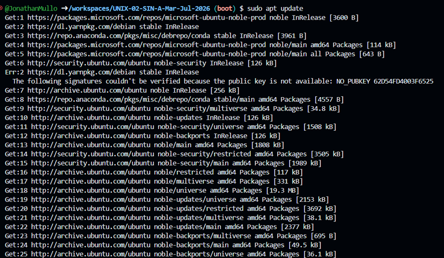
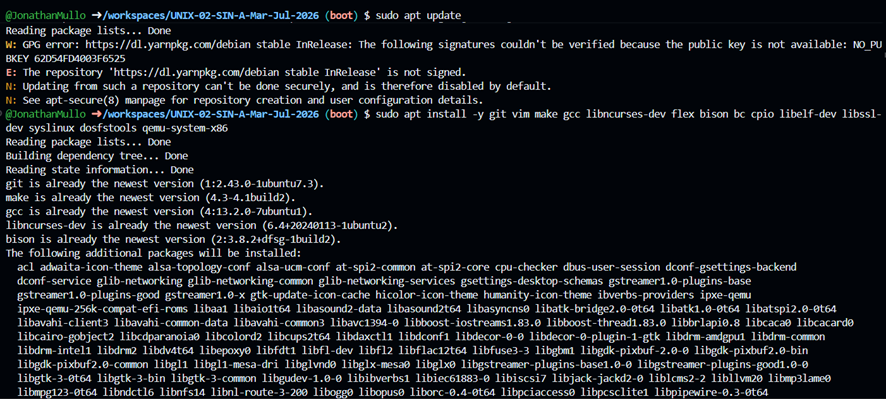

# UNIX-02-SIN-A-Mar-Jul-2026
Repo for intro to UNIX
1._Sudo apt update

2._ sudo apt install -y git vim make gcc libncurses-dev flex bison bc cpio libelf-dev libssl-dev syslinux dosfstools qemu-system-x86

3._